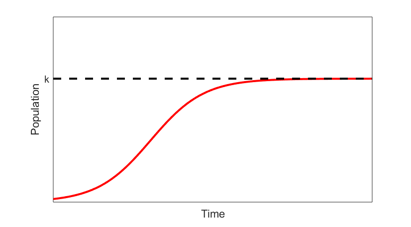
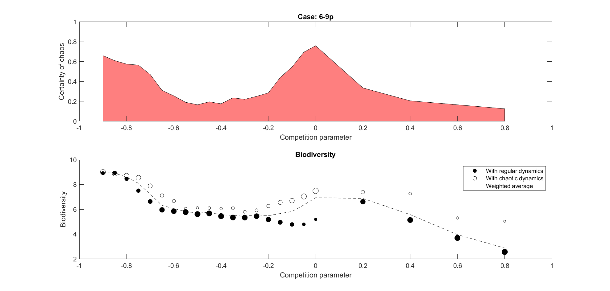

# Un paseo (y una maratón) por la dinámica de poblaciones

## Introducción
Si fuesen una familia, la teoría de sistemas dinámicos sería la respetable matriarca a la que todos tratan con respeto y algo de admiración... aunque lo cierto es que no siempre la entienden. El padre, más inclinado a las aplicaciones que a la teoría, sería el modelado matemático. Aunque también goza de mucho éxito y respeto, la familia ya se toma un poco a guasa sus constantes anécdotas sobre predicción de crisis bursátiles o embotellamientos de tráfico. La pareja, además de muchos sobrinos, tiene tres hijas. La mecánica, la aplicada primogénita, rayando en lo repelente, que siempre saca dieces. La cinética química, que se esfuerza en imitar a su hermana mayor con razonable éxito. Y la benjamina de la familia, la dinámica de poblaciones. Esta última, bueno, ... es complicado. Talento no le falta, pero siempre escoge los problemas más difíciles. Las masas puntuales y los sólidos rígidos que tanto gustan a su hermana mayor, e incluso los átomos y moléculas colisionando de su hermana mediana, le parecen mucho menos interesantes que los complejísimos ejemplos procedentes de la biología. La dinámica de poblaciones está orgullosa de no tener miedo a la complejidad, pero por otro lado, le gustaría que sus modelos funcionasen tan bien como los de sus hermanas mayores.

Trabajar en dinámica de poblaciones es el sueño de todo cotilla. Al fin y al cabo, se trata del estudio sistemático de cómo y cuánto se reproducen otros. Pero, ¿cómo es el día a día de alguien que se dedica a esto?. O lo que es lo mismo, ¿cómo se construye un modelo matemático de un sistema en dinámica de poblaciones? La respuesta corta es: como buenamente podemos. Una respuesta algo más desarrollada sería la siguiente:

1. Se decide qué tipo de información queremos obtener. Esta información suele consistir en las series temporales con la población de cada especie.
2. Se decide la herramienta matemática que vamos a usar. Las más comunes son ecuaciones en diferencias o ecuaciones diferenciales, pues son el ejemplo más sencillo de herramientas que nos permiten calcular el estado futuro de un sistema conociendo su estado actual. El siguiente nivel de complejidad lo proporcionan las ecuaciones diferenciales estocásticas, que incluyen efectos aleatorios. Por último, si estamos interesados en el efecto de las distribuciones espaciales de nuestras poblaciones, nuestra herramienta serán las mucho más complejas ecuaciones en derivadas parciales.
3. Se proponen hipótesis plausibles y se construye el modelo en base a ellas. Esta es, sin duda, la fase más delicada de todo el proceso. No es raro que haya que volver a repensar el paso 2 durante este paso.
4. Se resuelve la ecuación y se analizan los resultados.

## Un ejemplo sencillo
Veamos un ejemplo. Imaginemos que tenemos una pequeña cantidad de bacterias en una placa Petri llena de nutrientes. Sabemos que la población de bacterias crecerá, pero nos gustaría saber exactamente cómo. Por ejemplo, quisiéramos obtener la gráfica de la masa de bacterias en función del tiempo. Llamaremos $P(t)$ a esta curva. Acabamos de dar el paso 1. Para el paso 2, dado que queremos resolver un ejemplo sencillo, escogeremos una herramienta matemática sencilla: una ecuación diferencial ordinaria. El paso 3 es sin duda el más interesante. Como primera hipótesis, podemos pensar que la tasa de crecimiento per cápita (esto es, $\frac{1}{P}\frac{dP}{dt}$) es constante y positiva. Tendremos pues una ecuación diferencial como esta:

$$\frac{1}{P}\frac{dP}{dt} = r$$

Si resolvemos dicha ecuación, obtendremos un resultado muy poco realista: la población de bacterias crecerá exponencialmente, para toda la eternidad. Sabemos que esto no puede ser. Llegará un momento en el que, como mucho, habrán ocupado toda la placa Petri pero no más. Para simular este efecto, necesitamos que la tasa de crecimiento per cápita, es decir, la parte derecha de la ecuación, decrezca con $p$. La forma más sencilla de lograr este efecto es multiplicarla por un decaimiento lineal (marcado en azul):

$$\frac{1}{P}\frac{dP}{dt} = r \color{blue}{(1 - \frac{P}{k})}$$

Sin necesidad de resolver la ecuación diferencial, podemos ver que la tasa de crecimiento será aproximadamente $r$ cuando la población es pequeña y se irá reduciendo poco a poco hasta cero, cosa que sucede cuando la población es exactamente $k$.

El paso 4 es resolver la ecuación diferencial. Esta concretamente se puede resolver a mano. Su solución exacta depende de los valores numéricos que demos a los parámetros $r$ (relacionado con la velocidad de reproducción) y $k$, la máxima población que puede aguantar la placa Petri. Asimismo, como siempre que trabajamos con ecuaciones diferenciales, tenemos que indicar el valor inicial de la población.

En general, las soluciones tienen este aspecto.

Podemos ver cómo la minúscula población inicial crece, pero cada vez más despacio según se acerca a $k$.

Espero con esto haberte dado una idea del "sabor" de este peculiar campo de las matemáticas aplicadas. Si eres tan insensato como para querer saber más, puedo seguir contándote. Tengo carrete para rato. De hecho, mi primera publicación científica trataba precisamente sobre dinámica de poblaciones.

## Un ejemplo complicado

### La pregunta
Hacia 2003, un investigador llamado Hubbell, especializado en árboles tropicales, descubrió algo entre curioso y alarmante: creó un modelo súper cutre que resultó funcionar mejor que otros aparentemente más sofisticados. El modelo de Hubbell proponía algo bastante contraintuitivo: eliminar toda diferencia entre especies en el modelo matemático, de modo que las diferencias poblacionales a largo plazo eran mero efecto del azar. Uno de los éxitos de este controvertido modelo fue predecir mejor que otros modelos la biodiversidad, entendida como la cantidad de especies diferentes que pueden coexistir en un ecosistema sin extinguirse.

Pocos años antes, Huisman demostró que ciertos modelos sencillos, usados para estudiar el plankton marino, pueden desarrollar comportamiento caótico incluso bajo condiciones estables. A grandes rasgos, esto significa que estos sistemas nunca se estabilizan ni tampoco oscilan de forma periódica. Las diferentes poblaciones continúan "bailando" eternamente sin regularidad aparente. Curiosamente, en estos modelos el caos también beneficia a la biodiversidad. Una aproximación intuitiva sería la siguiente: el constante vaivén de las poblaciones evita que las condiciones para que se de una extinción se prolonguen durante tiempo suficiente como para que esta termine por suceder.

Lo que yo, o mejor dicho, mi director de tesis se preguntaba era: ¿están estos dos fenómenos relacionados?

### El modelo
Para responder a esta pregunta utilizamos un modelo básico predador-presa. Este tenía un nivel de depredadores (varios) y otro de presas (varias). Este modelo se ha utilizado antes para describir la interacción entre poblaciones de zooplankton y fitoplankton. Tiene la deseable propiedad de ser uno de los modelos más sencillos que pueden desarrollar comportamiento caótico incluso en el caso de competición neutral.

El aspecto de las ecuaciones que lo componen probablemente no te diga mucho:

$$
\begin{cases}
P_i'(t) =  r_i(P) P_i  - \sum_{j = 1}^{n_C} g_j(P) P_i S_{ji} C_j + f & : i = 1..n_P
\\
C_j'(t) = - l C_j +  e \sum_{i = 1}^{n_P} g_j(P) P_i S_{ji} C_j  & : j = 1..n_C
\end{cases}
$$

pero aquí estoy yo para explicar el quid de la cuestión. Los depredadores se alimentan de las presas, y además las presas compiten entre sí. Los parámetros del modelo controlan cosas como la "mala leche" con la que las especies de plankton presentes se tratan las unas a las otras. Estas interacciones de "mala leche" (depredación y competición) se pueden codificar en forma de red.

En un ecosistema como el de la figura, dos especies de depredadores comparten hábitat con tres especies de presas. Del grosor de los nexos de la red, podemos deducir que el depredador de arriba a la izquierda le tiene especial ojeriza a la presa del centro. El otro depredador, el de la derecha, es de estómago más agradecido y come de todo por igual. En cuanto a la competición entre presas, la presa del centro es claramente una trepa, fastidiando siempre que puede a las otras dos, pero respetando a los miembros de su propia especie. La de la derecha tiene tendencias autodestructivas: es especialmente agresiva contra los de su propia especie. Por último, la de la izquierda parece ser una especie compuesta por auténticos cabronazos, agresivos con todo el mundo, incluyendo a los de su misma especie.

En el ecosistema anterior, el número de interacciones que hay que codificar con su correspondiente parámetro es de nada menos que 15 (puedes contarlas directamente). 15 parámetros son un montón de parámetros, y eso que este es un ecosistema pequeño. Necesitamos reducirlos lo más posible. Para ello, en primer lugar nos olvidamos de los parámetros que codifican la depredación usando un truco muy poco sofisticado: escogiéndolos al azar. Los parámetros de la competición entre presas también los escogimos al azar, pero aquí introdujimos un parámetro (que llamamos parámetro de competición $\epsilon$) que controla el tipo de competición. Si el parámetro es negativo, todas las presas son más agresivas con las demás especies que consigo mismas. Si es positivo, las presas serán más agresivas con los miembros de su propia especie que con las demás. Entre lo positivo y lo negativo está, obviamente, el cero. En este caso, la competición será lo más parecido posible a neutral: las presas serán igual de agresivas con los de su propia especie y con los de otras ergo... de cara al modelo serán básicamente iguales.

Aunque a veces lo neguemos, lo primero que hacemos los que nos dedicamos al modelado matemático cuando tenemos un modelo es juguetear con él. Como nuestros parámetros son escogidos al azar, cada simulación individual arrojará un resultado diferente. Tras un rato probando, llegamos a la conclusión de que nuestro modelo puede dar lugar a tres tipos de comportamiento, resumidos en la siguiente figura.

A veces, las poblaciones se acaban estabilizando como en el caso A (algunas tienen la mala suerte de estabilizarse en 0, es decir, extinguirse). Otras veces, las especies que no se extinguen permanecen oscilando periódicamente como en el caso B. Por último, a veces obtenemos comportamientos que no encajan en ninguno de los dos apartados anteriores (caso C), y que tienen toda la pinta de ser caóticos. La observación interesante es que estos tres tipos de comportamiento no sucedían en la misma proporción. Aún es más, la probabilidad de obtener dinámica caótica parecía depender fuertemente del valor del parámetro de competición $\epsilon$.

Simulando una enorme cantidad de ecosistemas como estos, nos las apañamos para comprobar esta observación/intuición de manera más sistemática, y obtuvimos un resultado sorprendentemente limpio. En este tipo de modelos, la probabilidad de obtener caos alcanza su máximo cuando la competición es lo más neutral posible (ver primer panel en la figura más abajo).

Medimos, además, la biodiversidad de estos ecosistemas simulados. Para ello, simulamos durante un tiempo lo suficientemente largo como para estar seguros de haber llegado a lo que se conoce como un atractor. Una vez ahí, simplemente contamos el número de especies que no se habían extinguido. Observamos (ver segundo panel) que la neutralidad también beneficiaba a la biodiversidad.

El resultado sigue siendo cierto para redes con mayor número de especies interaccionando.

### La respuesta
Nuestras simulaciones muestran, en primer lugar, que la probabilidad de que un ecosistema desarrolle comportamiento caótico es máxima cuando la competición es neutral. En segundo lugar, muestran también que la dinámica caótica es muy positiva para la biodiversidad en nuestro modelo, incrementando significativamente esta. En resumen: los conceptos de caos, neutralidad y biodiversidad parecen estar, al menos en nuestro humilde modelo, inextricablemente unidos.
