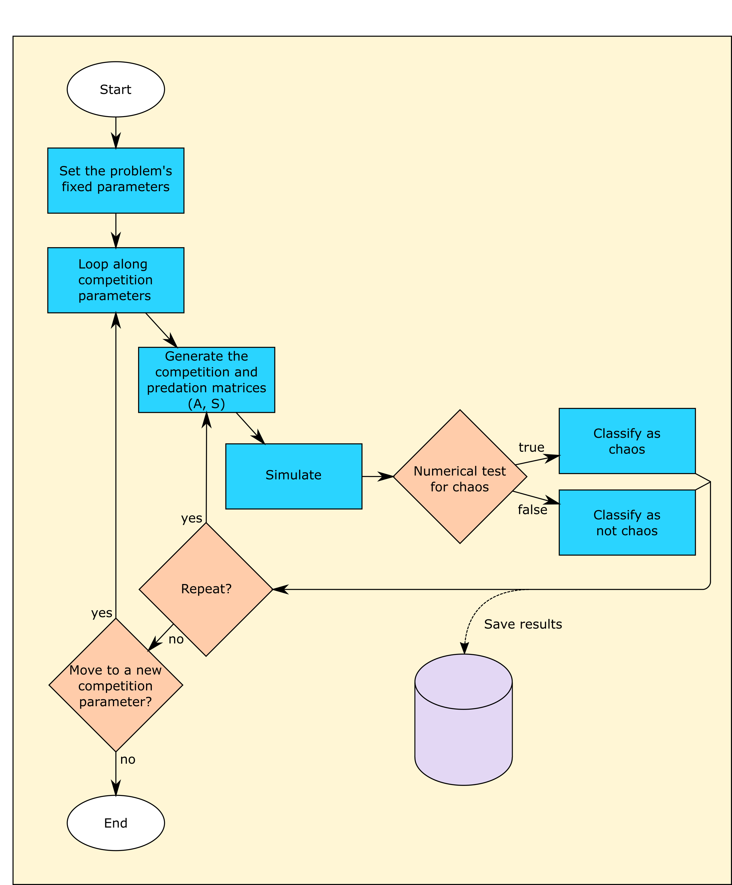

# About
This code is a supplementary material for the paper _Neutral competition boosts chaos in food webs_, by Pablo Rodríguez-Sánchez, Egbert H. van Nes and Marten Scheffer.

# Purpose
This collection of scripts simulates and analyzes a set of modelled ecosystems. In particular, we are interested in the effects of different types of competition on the asymptotic dynamics exhibited.

## Simulation
Each individual ecosystem is described by a differential equation, being the dynamics those of a generalized Rosenzweig-MacArthur equation [[1][RosMac]]. A competition parameter is introduced to sweep smoothly between dominant intraspecific competition and dominant interspecific competition. For each value of the competition parameter, several instances of the system are simulated, differing in predation rates and initial conditions.

## Analysis
The main purpose of the analysis is to classify each individual simulation as chaotic or non-chaotic. In order to do so, two parallel approaches are used: estimation of the maximum Lyapunov exponent [[2][Lyapunov]], and Gottwald-Melbourne z1 test [[3][z1]].

## Flow chart


# Usage
1. Add these folders and subfolders to Matlab's path.
2. The experiment(s) to be run are specified in  `/io/input.csv` (more information below).
3. Browse to the main folder, and execute `launch.m`.

Please note that the typical run time in a standard personal computer is around 3 hours per set (that is, per active row in the input file).

## Input
The expected input is the file `/io/input.csv`. This csv file contains the following fields:

* **id**: identification string. The name of the simulation.
* **active**: the simulation is executed only if active is true. Otherwise, it is ignored.
* **nPreys**: number of prey species to simulate.
* **nPreds**: number of predator species to simulate.
* **r**: prey's growth rate (d^-1).
* **K**: prey's carrying capacity (mg l^-1).
* **g**: predation rate (d^-1).
* **f**: immigration rate (mg l^-1 d^-1).
* **e**: assimilation efficiency.
* **H**: half-saturation constant (mg l^-1).
* **l**: predator's loss rate (d^-1).
* **simTime**: simulation time. Length of the time series in days.
* **stabilTime**: numerical stabilization time. Used to reach an attractor and minimize the effects of the initial conditions.
* **steps**: number of time steps. Length of the time series in steps.
* **lyapTime**: length of the simulation (in days) used for estimating the Lyapunov exponent.
* **lyapPert**: initial perturbation used for estimating the Lyapunov exponent.
* **reps**: number of times the experiment should be repeated. Provided some dynamical parameters are randomly generated, different runs will lead to different time series. Repeating the simulation opens the possibility of a statistical analysis.
* **compPars**: string containing details to reconstruct the competition parameters to be tested. The structure is: _"start step medium step end"_. For instance: -1 0.05 0 0.2 1 generates the concatenation of -1:0.05:0 and 0.2:0.2:1
* **seed**: seed for the random number generator. Fixing the seed ensures reproducitiblity of simulations involving random numbers. If you don't know how this works, just use any integer number (0, 1, ...).
* **results_folder**: path where the analysis results will be stored.
* **timeseries_folder**: path where the timeseries will be stored. The timeseries may require some Gb of disk space.


### Example

#### Plain text
```
id;active;nPreys;nPreds;r;K;g;f;e;H;l;simTime;stabilTime;steps;lyapTime;lyapPert;reps;compPars;seed;results_folder;timeseries_folder
sim1;true;2;3;0.5;10;0.4;1e-5;0.6;2;0.15;5000;2000;5000;100;1e-8;200;-0.9 0.05 0 0.2 0.9;1;io/;io/
sim2;true;4;6;0.5;10;0.4;1e-5;0.6;2;0.15;5000;2000;5000;100;1e-8;200;-0.9 0.05 0 0.2 0.9;1;io/;io/
```

#### Formatted

| id   | active | nPreys | nPreds | r   | K  | g   | f    | e   | H | l    | simTime | stabilTime | steps | lyapTime | lyapPert | reps | compPars            | seed | results_folder | timeseries_folder |
|:-----|:-------|:-------|:-------|:----|:---|:----|:-----|:----|:--|:-----|:--------|:-----------|:------|:---------|:---------|:-----|:--------------------|:-----|:---------------|:------------------|
| sim1 | true   | 2      | 3      | 0.5 | 10 | 0.4 | 1e-5 | 0.6 | 2 | 0.15 | 5000    | 2000       | 5000  | 100      | 1e-8     | 200  | -0.9 0.05 0 0.2 0.9 | 1    | io/            | io/               |
| sim2 | true   | 4      | 6      | 0.5 | 10 | 0.4 | 1e-5 | 0.6 | 2 | 0.15 | 5000    | 2000       | 5000  | 100      | 1e-8     | 200  | -0.9 0.05 0 0.2 0.9 | 1    | io/            | io/               |


Please note that the separators are:

* **semicolon (;)** for new column
* **new line** for new row

## Output
The output is a set of _m_ files, one per numerical experiment. Its filename coincides with the field _id_ in the input file, that is, experiment with id _sim1_ will generate the file `/io/sim1.m`.

It contains the variable _resultsArray_, a cell of structs. Each individual struct contains information about an individual simulation.

The fields are:

* **id**: identification string. The name of the simulation.
* **dims**: the dimensions of the systems. In the form [number of predator species, number of prey species]
* **stabilTime**: numerical stabilization time. Used to reach an attractor and minimize the effects of the initial conditions.
* **competition_par**: the value of the competition parameter for the selected simulation.
* **maxLyapunov**: the estimated maximum Lyapunov exponent for this simulation.
* **chaosTests**: a struct containing booleans (true/false) for a couple of different tests of chaoticity.

## Credits
The function **z1test** was adapted, with permission of the author, from [GRIND for Matlab][grind].

  [Published]: http://url.com
  [Preprint]: http://arxiv.com
  [RosMac]: https://www.journals.uchicago.edu/doi/10.1086/282272
  [Lyapunov]: http://www.mathematica-journal.com/issue/v6i3/article/sandri/contents/63sandri.pdf
  [z1]: https://arxiv.org/pdf/0906.1418.pdf
  [grind]: http://www.sparcs-center.org/grind
